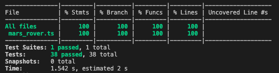

## Mars Rover Kata

- This is a solution to the [Mars Rover Kata from TDD Buddy](http://www.tddbuddy.com/katas/Mars%20Rover.pdf) in TypeScript
- The aim was to follow `TDD` as closely as possible with the `RED-GREEN-REFACTOR` cycle, letting the tests write the code

## Description

- The Mars Rover moves on a grid with a string of commands, `"f"` for foward, `"b"` for backward, `"l"` for turn left and `"r"` for turn right.
- It is facing either North (`"n"`), South (`"s"`), East(`"e"`) or West(`"w"`), which determines it's movements.
- The grid has edge wrapping, as if on a spherical planet.

## Refactoring

- After all passing tests and implemented acceptance criteria, final refactors included swapping some `switch` statements with maps (ex. `"f": this.#moveForward` and `commandMap.get("f")()`) for commands, and array indexing for right (`["e", "s", "w", "n", "e"]`) and left (`["e", "n", "w", "s", "e"]`) turns.

- `switch` statements do not offer good pattern matching, and are littered with `break` statements (without a `break` the next case will be executed even if the evaluation does not match the case!).There is a great proposal for [match](https://github.com/tc39/proposal-pattern-matching), which would make this code much better. Thank you [John](https://github.com/JohnForster) for pointing it out. For TS, there is also a [ts-pattern](https://github.com/gvergnaud/ts-pattern#match) package that will help refactor some maps where mutliple pattern matches should have the same value.

## Testing and Coverage

- Check the commit history to see the detailed `TDD` process and `RED-GREEN-RAFACTOR` steps.
- The test progression uses triangulation and breaks one assumption per tests.
- An example commit might be `"passing test for wrappign y-axis moving backward facing north"` or `"passing test for wrappign y-axis moving forward facing south"`.

## Use

- Run `npm install`
- Run tests with `npm run test`
